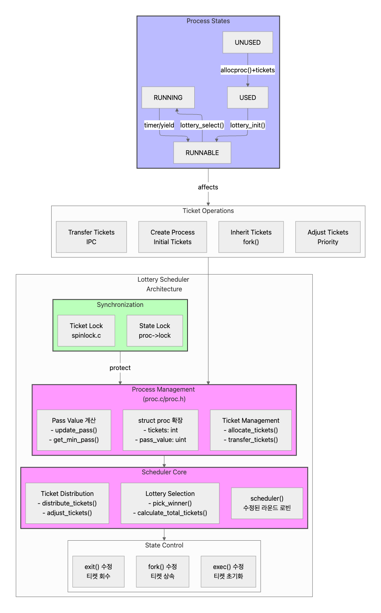

# TIL: xv6에 Stride-Lottery 스케줄러 구현하기

## 📚 오늘 배운 것
xv6 운영체제에 Stride Scheduling과 Lottery Scheduling을 결합한 하이브리드 스케줄러를 구현했습니다.

## 💡 주요 개념

### Stride Scheduling이란?
- 각 프로세스에 티켓 수에 반비례하는 stride 값 할당
- pass value가 가장 작은 프로세스를 선택해 실행
- 실행 후 해당 프로세스의 pass value를 stride만큼 증가
- 결과적으로 티켓 수에 비례하는 CPU 시간 보장
- 장점: 정확한 비율로 CPU 시간 분배
- 단점: pass value 오버플로우 가능성

### Lottery Scheduling이란?
- 각 프로세스에 티켓 할당
- 무작위로 당첨 티켓을 뽑아서 해당 프로세스 실행
- 확률적으로 티켓 수에 비례하는 CPU 시간 할당
- 장점: 구현 단순, 동적 변경 용이
- 단점: 정확한 비율 보장 어려움

## 🔨 구현 과정



### 1. 데이터 구조 설계
```c
// proc.h
struct proc {
    _Atomic uint tickets;     // 프로세스의 티켓 수
    _Atomic uint pass_value;  // 현재까지의 pass 값
}
```
- `_Atomic` 사용 이유: 동시성 문제 해결
- uint 사용 이유: 음수 티켓 방지

### 2. 핵심 함수 구현

#### 스케줄러 메인 로직 (proc.c:548-614)
```c
void scheduler(void) {
    // 1. Primary: Stride Scheduling
    p = get_min_pass_proc();              // 최소 pass value 프로세스 찾기
    if(p) {
        p->state = RUNNING;
        update_pass(p);                   // pass value 증가
        swtch(&c->context, &p->context);  // 컨텍스트 스위치
        found = 1;
    }

    // 2. Fallback: Lottery Scheduling  
    if(!found) {
        uint winner = random() % total_tickets;  // 당첨 티켓 선택
        // 당첨된 프로세스 찾기
    }
}
```

#### Pass Value 시스템
```c
static void update_pass(struct proc *p) {
    if(p->tickets > 0) {
        p->pass_value += (1000000 / p->tickets);  // 반비례 관계
    }
}
```

- 티켓이 많을수록 → pass 증가값 작음 → CPU 시간 많이 받음
- 티켓이 적을수록 → pass 증가값 큼 → CPU 시간 적게 받음
- 항상 최소 pass value를 가진 프로세스 선택

예시:
- 프로세스 A: 200 티켓 → pass += 5000 (실행당)
- 프로세스 B: 100 티켓 → pass += 10000 (실행당)
- 프로세스 A가 B보다 2배 자주 실행됨

#### Lottery 스케줄링 (폴백 방식)

당첨자 선택 로직:
```c
uint winner = random() % total_tickets;
uint counter = 0;

for(p = proc; p < &proc[NPROC]; p++) {
    if(p->state == RUNNABLE) {
        counter += p->tickets;
        if(counter > winner) {
            // 이 프로세스가 당첨!
            break;
        }
    }
}
```

프로세스 A: 200 티켓 [0-199]

프로세스 B: 100 티켓 [200-299]

프로세스 C: 50 티켓  [300-349]

=> 총 티켓: 350개

Random(0-349) 결과:
- 0-199   → A 당첨 (57% 확률)
- 200-299 → B 당첨 (29% 확률)
- 300-349 → C 당첨 (14% 확률)

### 3. 프로세스 생명주기 관리

#### 초기화
```c
static void lottery_init(struct proc *p) {
    p->tickets = DEFAULT_TICKETS;  // 기본값: 100 티켓
    p->pass_value = 0;            // pass value 초기화
}
```

#### 티켓 관리
```c
int settickets(int number) {
    struct proc *p = myproc();
    acquire(&p->lock);
    p->tickets = number;
    p->pass_value = 0;  // pass value 리셋
    release(&p->lock);
}
```

#### 난수 생성기
```c
uint random(void) {
    // 여러 엔트로피 소스 조합
    seed ^= r_time();           // 현재 시간
    seed += (ticks << 8);       // 시스템 틱
    seed ^= (r_sp() >> 3);      // 스택 포인터
    seed = seed * 1664525 + 1013904223;  // LCG 공식
    return seed;
}
```

### 하이브리드 방식을 선택한 이유

#### Stride 스케줄링의 장점:
- 결정적 공정성 - 비례적 CPU 시간 보장
- 낮은 스케줄링 오버헤드 - O(1) 선택
- 기아 현상 방지 - 불공정성 한계 존재

#### Lottery 스케줄링의 장점:
- 단순성 - 이해와 구현이 쉬움
- 확률적 공정성 - 평균적으로 좋은 동작
- 폴백 신뢰성 - stride 실패시 대체 가능

#### 결합의 이점:
- Stride로 정밀한 공정성 제공
- Lottery로 안정성 보장
- 모든 상황에서 시스템 응답성 유지

## 🎯 실제 동작 예시

### 시나리오 1: Stride Scheduling
1. 프로세스 A(tickets=100), B(tickets=50), C(tickets=25) 있음
2. stride 값: A=10, B=20, C=40 (1000/tickets)
3. 실행 순서:
   ```
   A(pass=10) → B(pass=20) → A(pass=20) → C(pass=40) → A(pass=30) ...
   ```
4. 결과적으로 A:B:C = 4:2:1 비율로 CPU 시간 할당

### 시나리오 2: Lottery Scheduling (fallback)
- 프로세스 A, B, C가 있고 각각 100, 50, 25개의 티켓을 가짐
1. 총 티켓 수 = 175 (A:100 + B:50 + C:25)
2. 무작위 수 생성 (0~174)
3. 당첨된 프로세스 실행
4. 확률적으로 A:B:C = 4:2:1 비율로 CPU 시간 할당

## 🚀 성능 최적화

### 1. CPU 최적화
- 부동소수점 연산 제거
  ```c
  // 기존: stride = 1.0 / tickets
  // 개선: stride = scale_factor / tickets
  pass_value += 1000000/tickets;
  ```
- 불필요한 락 획득 최소화
- 캐시 라인 고려한 데이터 구조

### 2. 메모리 최적화
- 필요한 경우만 락 획득
- 캐시 친화적 데이터 구조 설계
- 메모리 누수 방지를 위한 자원 회수

## ❗ 해결한 문제들

1. **동기화 문제**
   - 문제: Race condition 발생
   - 해결: `_Atomic` + spinlock 조합 사용
   - 교훈: 세밀한 동기화 전략 필요

2. **오버플로우 문제**
   - 문제: pass_value 오버플로우
   - 해결: 주기적 리셋 검토 중
   - 교훈: 경계 조건 처리 중요

3. **공정성 문제**
   - 문제: 순수 Lottery의 불안정성
   - 해결: Stride 우선, Lottery 폴백
   - 교훈: 하이브리드 접근의 장점

## 📝 배운 점

1. **OS 구현의 실제**
   - 이론과 구현의 차이
   - 동시성 처리의 중요성
   - 자원 관리의 복잡성

2. **최적화와 안정성**
   - 성능과 안정성의 균형
   - 동기화 오버헤드 관리
   - 확장성 있는 설계의 중요성

## 🤔 더 공부할 것

1. 멀티코어 환경에서의 스케줄링
   - CPU 간 부하 분산
   - 캐시 친화적 스케줄링

2. 그룹 스케줄링 구현 방법
   - 프로세스 그룹화
   - 계층적 스케줄링

3. CFS 스케줄러 구현
   - Red-Black 트리 활용
   - virtual runtime 개념

4. 현재 구현의 개선점
   - Data racing 문제 해결
   - 메모리 할당/해제 검증
   - 동기화 전략 개선

5. C 언어 심화 학습
   - 포인터와 메모리 관리
   - 동시성 프로그래밍
   - 커널 프로그래밍 기법
   
6. 난수 생성 방법
